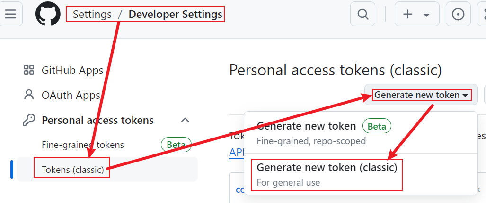

# Electron_App
本仓库仅做electron的App发布测试

# 1.Electron_App发布的详细步骤

1.首先,在github上创建一个空白的仓库,将其拉取到桌面上

2.本仓库的内容,主要基于,两个重要的官方教程:

(下面两个网站只需要打开,具体步骤从第3步开始)

1)创建electronApp的具体步骤:

https://www.electronforge.io/

2)设置github仓库信息的具体步骤:

https://www.electronforge.io/config/publishers/github

3.拉去一个官方仓库(这里正式开始)

https://www.electronforge.io/      这个网站写了很多,但那个是直接初始化一个本地仓库

其实,可以直接进入"我们提前创建好的仓库",cd进去,然后执行下面这段代码即可

`npm init electron-app@latest my-app`
这行命令真的很棒,把需要的模块和文件都设置好了,而且使用的是electron-forge工具,而不是简单的electron(By the way, electron-forge更加容易实现项目的打包)

4.运行app

```
cd my-app
npm start
```

此时,electronApp已经能够成功运行,如果运行不起来,那就是你的环境没配好,或者是一些其他的问题..

5.对项目进行打包,项目会打包到out文件夹中(out文件夹会自动生成)

npm run make

6.将的测试项目发布到github上

1)安装必要的依赖

npm install --save-dev @electron-forge/publisher-github

2)添加发布的信息

```js
在forge.config.js中添加一段信息:
publishers: [
    {
      name: '@electron-forge/publisher-github',//这个保持不变
      config: {
        repository: {
          owner: 'AAAAA',//下面这两个要改
          name: 'BBBBB'//git@github.com:AAAAA/BBBBB.git
        },
        prerelease: true
      }
    }
  ]
```


3)配置github上的令牌

[Settings](https://github.com/settings)->Developer settings

然后:



除了delete:packages之外,其他全部勾选,然后点击Generate token,

然后你会得到一个token(这个token只在初次创建时可见),

最后,在你的Window电脑中设置token:  在cmd中执行  `setx GITHUB_TOKEN your_token`  (如果是macOS / Linux,则执行`export GITHUB_TOKEN=your_token`,macOS / Linux好像还需要执行`source ~/.bashrc`才可以生效,但是Window不用,你重新打开一个cmd就可以了)

4)发布

npm run publish

此时项目已经发布成功!

注意:发布的exe文件,在你的release目录下,比如当前仓库的releases目录为:https://github.com/1AoB/Electron_App/releases


>补充: 2024-10-12 今天才发现:原来release是在这里,这个Release是可以点击的
>


# 2.然后你可以同步一下,你的仓库

```bash
git add .
git commit -m "xxx"
git push
```

# 3.接着尝试发布你的v2.0.0版本

打开你的 `package.json` 文件，将 `version` 字段更新为 `2.0.0`。

```json
{
  "name": "my-app",
  "version": "2.0.0",//其实只需要修改这里就可以了
  ...
}
```

执行 npm run publish ,发布成功!
